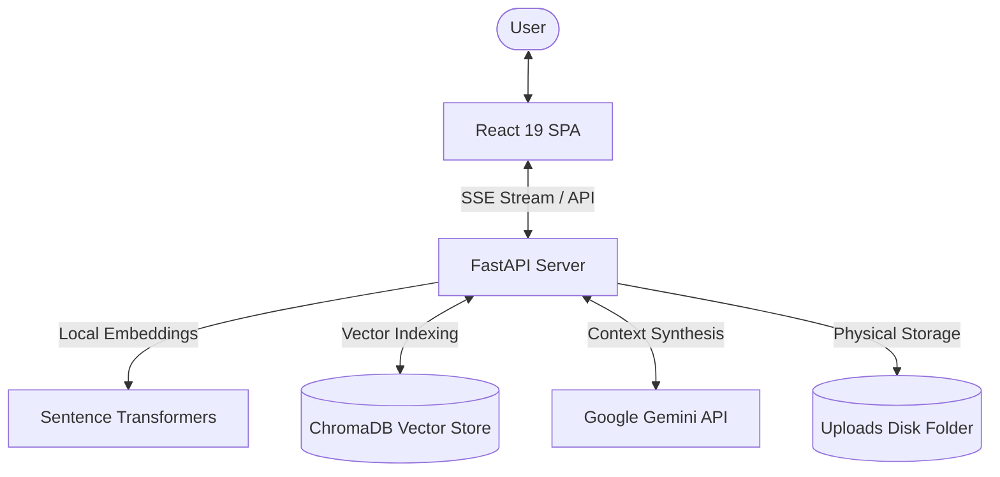

# 🚀 RAGForge: Commercial-Grade Enterprise Document AI Assistant

RAGForge is a high-performance, ChatGPT-style RAG (Retrieval-Augmented Generation) application designed for semantic document search, real-time contextual question-answering, and conversational analysis.

It is built with a fast **FastAPI** backend, a modern **React 19** frontend, **Tailwind CSS v4** for clean UI, and utilizes **ChromaDB** for vector storage and **Google Gemini** for LLM response synthesis.

---

## 🛠️ Technology Stack
* **Frontend**: React 19 (Vite), Tailwind CSS v4, Lucide Icons, Axios.
* **Backend**: FastAPI, Uvicorn, Pydantic v2, Python-Multipart.
* **Vector Store**: ChromaDB (persistent local SQLite collection).
* **Embeddings**: Sentence-Transformers (`all-MiniLM-L6-v2` running locally).
* **LLM Core**: Google Gemini (`gemini-2.0-flash` / `gemini-3.5-flash`).

---

## ✨ Key Features
1. **ChatGPT-Style Chat Experience**:
   - Streamed answers via Server-Sent Events (SSE).
   - Natural, direct tone—completely free of robotic references to "context chunks" or "based on documents."
   - Standardized General AI Knowledge fallback if uploaded documents do not contain the target answer.
2. **Interactive Documents Manager Hub**:
   - Drag-and-drop PDF ingestion with validation checks for file types and empty PDFs.
   - Unique hash calculations preventing redundant vector store indexing.
   - Robust document deletion (removes PDFs, indexes, and ChromaDB records with zero orphans).
   - Collapsible citation cards (**View Details**) displaying matching page numbers and document preview segments.
3. **Advanced Chat Session History**:
   - Dynamic sidebar grouping (Today, Yesterday, Previous 7 Days, Older).
   - Session renaming (Enter to save, Escape to cancel) and deletion.
   - Dynamic sorting: most active threads automatically bubble to the top.

---

## 📐 Architecture


---

## ⚙️ Project Setup

### 1. Backend Setup
1. Navigate to the `backend/` directory:
   ```bash
   cd backend
   ```
2. Create and activate a Python virtual environment:
   ```bash
   python -m venv venv
   # On Windows:
   .\venv\Scripts\activate
   # On macOS/Linux:
   source venv/bin/activate
   ```
3. Install dependencies:
   ```bash
   pip install -r requirements.txt
   ```
4. Copy the environment configuration file:
   ```bash
   copy .env.example .env
   ```
   Provide your `GEMINI_API_KEY` inside `.env`.
5. Run the FastAPI development server:
   ```bash
   python -m uvicorn app.main:app --host 127.0.0.1 --port 8000
   ```

### 2. Frontend Setup
1. Navigate to the `frontend/` directory:
   ```bash
   cd ../frontend
   ```
2. Install Node packages:
   ```bash
   npm install
   ```
3. Launch the Vite development server:
   ```bash
   npm run dev
   ```
4. Open your browser and navigate to `http://localhost:5173`.

---

## 🧪 Testing & Verification Scripts
RAGForge features built-in verification and performance profiling tools:
* **RAG Pipeline Test (`test_rag_pipeline.py`)**: Runs complete end-to-end assertions against the index pipeline, vector database matches, and response generation.
* **Performance Benchmark (`run_performance_benchmark.py`)**: Measures and outputs latency breakdowns for embedding generation, database similarity queries, LLM latency, and overall response time.
